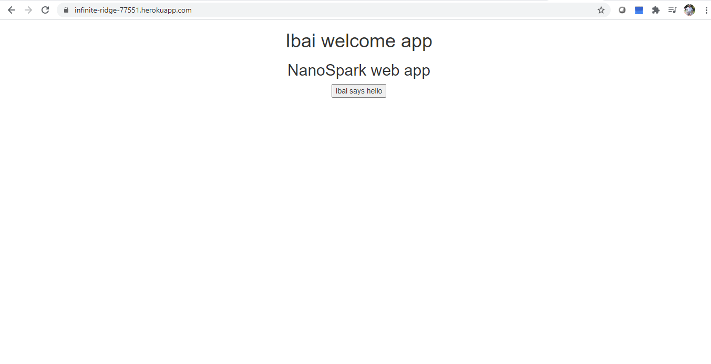
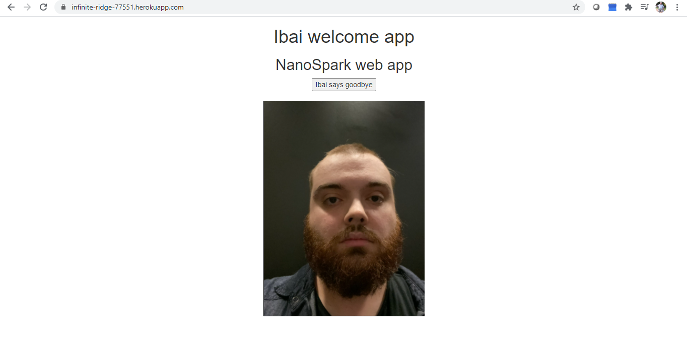
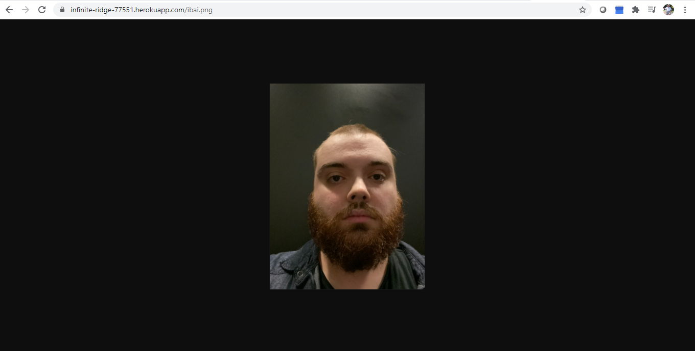
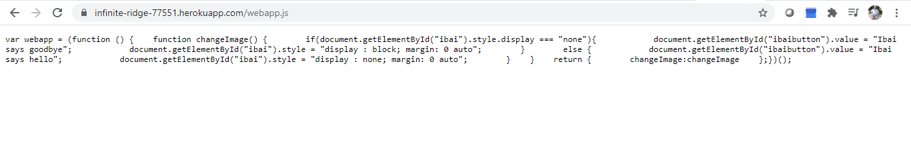
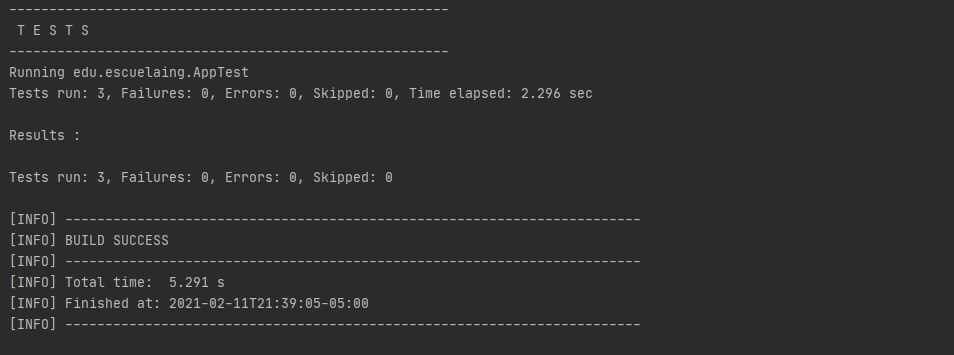

# AREP-LAB4

[](https://areplab4nicolasac.herokuapp.com/)

[](https://app.circleci.com/pipelines/github/NicolasAguilera9906/AREP-LAB4)

# Objective

For this workshop,  Web server is built (Apache type) in Java. The server must be able to deliver html pages and PNG images. Likewise, the server must provide an IoC framework for the construction of web applications from POJOS. Using the server, a sample web application must be built and deployed on Heroku. The server must serve multiple non-concurrent requests.

### Prerequisites

* [Maven](https://maven.apache.org/) - Dependency Management
* [Java 8](https://www.oracle.com/co/java/technologies/javase/javase-jdk8-downloads.html) -  Development Environment 
* [Git](https://git-scm.com/) - Version Control System

### Installing

1. Clone the repository

```
https://github.com/NicolasAguilera9906/AREP-LAB4/
```

2. Compile the projet

```
mvn package
```

3. Executing the program

```
mvn exec:java -D "exec.mainClass"="edu.eci.demo.Application" 

In your browser: 
For view main page : http://localhost:35000/index.html
For view nano spring app : http://localhost:35000/nsapp/hellomundo?value=nicolas. Replace nicolas with your name 

```

4. Generating the documentation

```
mvn javadoc:javadoc
```


## Documentation

View [Documentation](https://nicolasaguilera9906.github.io/AREP-LAB4/)

## Use

### Use

## Resources loader

To use Challenge 1 you must enter the following link in your browser

If you use it locally : http://localhost:35000/index.html

If you use it on Heroku : https://infinite-ridge-77551.herokuapp.com/index.html

You will get access to the following page



By clicking on the button you can load a static resource, in this case an image



You can also access that image from the url putting /ibai.png at the end of the url



You can also access the javascript on which the page is loaded from the url putting /webapp.js at the end of the url



## Nano Spring app

## Diagrams

## Tests 

3 tests were made proving that the application will correctly find the static resources




## Built With

* [Maven](https://maven.apache.org/) - Dependency Management
* [Heroku](https://www.heroku.com/platform) - Deploy platform
* [Firebase Realtime Database](https://firebase.google.com/products/realtime-database?hl=es) - Cloud-hosted NoSQL database

## Inform

* [View inform](src/main/resources/inform.pdf)

## Author

* **Nicolás Aguilera Contreras** 


## License

This project is under GNU General Public License - see the [LICENSE](LICENSE) file for details.


